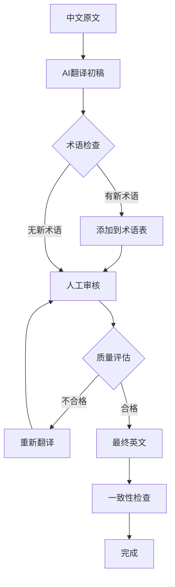

# Design: Full-Site Bilingual Support

**Change ID**: implement-full-site-bilingual-support
**Created**: 2025-11-03

---

## Architectural Decision Records (ADRs)

### ADR-1: HTML Attribute Marking vs JavaScript Dynamic Rendering

**Context**:

需要选择静态HTML内容的双语化实现方案。主要考虑两种方案：
1. **HTML属性标记**: 在HTML中为每段文字添加 `lang="zh"` 和 `lang="en"` 两个版本
2. **JavaScript动态渲染**: 建立翻译数据文件（i18n.js），用JS根据语言动态替换文本

**Decision**: ✅ 选择 **HTML属性标记方案**

**Rationale**:

| 维度 | HTML属性标记 | JavaScript动态渲染 |
|------|-------------|-------------------|
| **SEO** | ✅ 优秀 - 内容在HTML中，搜索引擎可索引 | ❌ 较差 - 内容在JS中，需要等待执行 |
| **首屏性能** | ✅ 快速 - 内容直接在HTML中 | ❌ 较慢 - 需等待JS加载和执行 |
| **可维护性** | ✅ 高 - 内容和结构在一起 | ❌ 中 - 内容和结构分离 |
| **无障碍性** | ✅ 优秀 - 屏幕阅读器直接读取HTML | ❌ 一般 - 依赖JS执行后才能读取 |
| **HTML文件大小** | ❌ 增大约2倍 | ✅ 保持原大小 |
| **实现复杂度** | ✅ 简单 - 主要是CSS规则 | ❌ 复杂 - 需要完整的i18n框架 |

**Implementation**:

```html
<!-- Pattern: 双语标记 -->
<element>
  <span lang="zh">中文内容</span>
  <span lang="en">English Content</span>
</element>
```

```css
/* 根据data-lang属性控制显示 */
[data-lang="zh"] [lang="en"],
[data-lang="en"] [lang="zh"] {
  display: none;
}
```

**Trade-offs**:
- ✅ **优点**: SEO友好、性能好、可维护性高、无障碍性好
- ❌ **缺点**: HTML文件增大约2倍（但对于静态网站可接受）

---

### ADR-2: Navigation Menu - JavaScript i18n vs HTML Marking

**Context**:

导航菜单（主画廊、评论家、关于、过程）有两种双语化方案：
1. **HTML标记**: 与页面内容相同，使用 `<span lang="zh/en">`
2. **JavaScript i18n**: 建立翻译对象，用JS动态更新菜单文字

**Decision**: ✅ 选择 **JavaScript i18n方案**

**Rationale**:

导航菜单与页面静态内容不同，有特殊考虑：

| 维度 | HTML标记 | JavaScript i18n |
|------|---------|----------------|
| **内容量** | 小（仅4个菜单项） | 小 |
| **变更频率** | 低（菜单项固定） | 低 |
| **DOM复杂度** | ❌ 高 - 每个菜单项包含2个span | ✅ 低 - 1个文本节点 |
| **代码集中度** | ❌ 分散在4个HTML文件 | ✅ 集中在1个JS文件 |
| **SEO重要性** | ❌ 低 - 菜单项不需要被索引 | ✅ 无影响 |
| **动画兼容性** | ❌ 较差 - span切换可能导致闪烁 | ✅ 好 - 文本直接替换 |

**Implementation**:

```javascript
// js/navigation-i18n.js
const NAV_I18N = {
  'menu-home': { zh: '主画廊', en: 'Gallery' },
  'menu-critics': { zh: '评论家', en: 'Critics' },
  'menu-about': { zh: '关于', en: 'About' },
  'menu-process': { zh: '过程', en: 'Process' }
};

function updateMenuLanguage(lang) {
  Object.keys(NAV_I18N).forEach(key => {
    const element = document.querySelector(`.${key} .menu-label`);
    if (element) {
      element.textContent = NAV_I18N[key][lang];
    }
  });
}

// 监听语言切换事件
document.addEventListener('langchange', (e) => {
  updateMenuLanguage(e.detail.lang);
});
```

**Trade-offs**:
- ✅ **优点**: DOM简洁、代码集中、动画友好
- ❌ **缺点**: 需要JS加载后才能显示正确语言（但菜单本身就依赖JS）

---

### ADR-3: URL Language Parameter Strategy

**Context**:

用户要求支持URL语言参数（`?lang=en`），需要设计语言选择的优先级策略。

**Decision**: ✅ URL参数 > localStorage > 默认值（zh）

**Rationale**:

**优先级逻辑**:
1. **URL参数** (`?lang=en`): 最高优先级 - 用于分享特定语言版本
2. **localStorage** (`preferred-lang`): 次优先级 - 记住用户偏好
3. **默认值** ('zh'): 最低优先级 - 默认显示中文

**Use Cases**:

| 场景 | URL | localStorage | 最终语言 | localStorage更新 |
|------|-----|--------------|---------|-----------------|
| 首次访问 | - | - | zh | 保存 'zh' |
| 用户切换为英文 | - | zh | en | 更新为 'en' |
| 点击英文链接 | ?lang=en | zh | en | ❌ 不更新（保持zh） |
| 再次访问（无URL参数） | - | en | en | 保持 'en' |

**Implementation**:

```javascript
// js/lang-manager.js
class LanguageManager {
  constructor() {
    this.defaultLang = 'zh';
    this.storageKey = 'preferred-lang';
  }

  getCurrentLanguage() {
    // 1. Check URL parameter
    const urlParams = new URLSearchParams(window.location.search);
    const urlLang = urlParams.get('lang');
    if (urlLang && ['zh', 'en'].includes(urlLang)) {
      return urlLang;
    }

    // 2. Check localStorage
    const storedLang = localStorage.getItem(this.storageKey);
    if (storedLang && ['zh', 'en'].includes(storedLang)) {
      return storedLang;
    }

    // 3. Default
    return this.defaultLang;
  }

  setLanguage(lang, updateStorage = true) {
    document.documentElement.setAttribute('data-lang', lang);

    // Only update localStorage if not from URL parameter
    if (updateStorage) {
      localStorage.setItem(this.storageKey, lang);
    }

    // Dispatch custom event for other components
    document.dispatchEvent(new CustomEvent('langchange', { detail: { lang } }));
  }
}
```

**Trade-offs**:
- ✅ **优点**: URL分享不会改变用户偏好、逻辑清晰、易于测试
- ⚠️ **注意**: URL参数不会更新localStorage（设计选择，避免干扰用户偏好）

---

### ADR-4: Meta Tag Dynamic Update Strategy

**Context**:

需要让SEO相关的meta标签（description, og:description）也支持双语切换。

**Decision**: ✅ 使用 JavaScript动态更新meta标签

**Rationale**:

**Considered Approaches**:
1. **HTML重复标签**: 为每种语言添加独立的meta标签
   - ❌ 不符合HTML规范（meta标签不能重复）
2. **服务器端渲染**: 根据请求参数返回不同语言的HTML
   - ❌ 本项目是静态网站，无服务器端
3. **JavaScript动态更新**: 根据语言切换更新meta标签的content属性
   - ✅ 可行且符合规范

**Implementation**:

```javascript
// js/lang-manager.js - updateMetaTags method
const META_I18N = {
  'description': {
    '/pages/about.html': {
      zh: '关于VULCA - AI艺术评论实验系统，探索跨时代评论家视角和RPAIT五维评论框架',
      en: 'About VULCA - AI-powered art criticism experimental system exploring cross-temporal critic perspectives and RPAIT five-dimensional framework'
    },
    '/pages/critics.html': {
      zh: 'VULCA艺术评论家简介 - 了解6位跨越时代的艺术评论家如何评价当代艺术',
      en: 'VULCA Art Critics - Discover how 6 cross-temporal critics evaluate contemporary art'
    },
    '/pages/process.html': {
      zh: 'VULCA系统开发过程 - 研究设计、角色建模、评论生成、数据验证的完整流程',
      en: 'VULCA Development Process - Complete workflow of research design, persona modeling, critique generation, and data validation'
    }
  },
  'og:description': {
    // ... similar structure
  }
};

function updateMetaTags(lang) {
  const path = window.location.pathname;

  // Update description
  const descMeta = document.querySelector('meta[name="description"]');
  if (descMeta && META_I18N.description[path]) {
    descMeta.setAttribute('content', META_I18N.description[path][lang]);
  }

  // Update og:description
  const ogDescMeta = document.querySelector('meta[property="og:description"]');
  if (ogDescMeta && META_I18N['og:description'][path]) {
    ogDescMeta.setAttribute('content', META_I18N['og:description'][path][lang]);
  }
}
```

**SEO Considerations**:
- ✅ Meta标签更新在DOM中生效
- ⚠️ 搜索引擎爬虫可能不会执行JS（但主要内容在HTML中，影响有限）
- ✅ 社交媒体分享（Facebook/Twitter）通常会执行JS，能正确读取更新后的meta标签

**Trade-offs**:
- ✅ **优点**: 实现简单、符合HTML规范、支持动态切换
- ❌ **缺点**: 依赖JS执行（但对于社交分享和现代爬虫不是问题）

---

### ADR-5: Translation Quality Assurance Process

**Context**:

用户要求**学术级翻译**，需要设计一个确保翻译质量的流程。

**Decision**: ✅ AI辅助 + 人工审核的两阶段流程

**Process**:



**Stage 1: AI辅助翻译**

使用 Claude Sonnet 4.5 进行初稿翻译，提示词包含：
- 目标受众：国际学术界
- 语言风格：学术写作、正式、专业
- 特殊要求：保留专业术语、保持语义完整性
- 术语表：已知术语的标准翻译（RPAIT, griot, defamiliarization等）

**Stage 2: 人工审核**

检查清单：
- [ ] **准确性**: 是否准确传达原文含义？
- [ ] **流畅性**: 是否符合英语学术写作规范？
- [ ] **术语一致性**: 专业术语是否使用了术语表中的标准翻译？
- [ ] **完整性**: 是否有遗漏或简化的内容？
- [ ] **语法正确性**: 是否有语法错误或拼写错误？
- [ ] **风格一致性**: 是否与中文原文保持一致的专业性和语气？

**Translation Glossary**:

建立 `TRANSLATION_GLOSSARY.md` 确保术语一致性：

| 中文术语 | 英文翻译 | 首次出现位置 | 备注 |
|---------|---------|-------------|------|
| RPAIT框架 | RPAIT Framework | about.html | 不翻译缩写 |
| 代表性 | Representation | about.html | RPAIT的R |
| 哲学性 | Philosophicality | about.html | RPAIT的P |
| 美学性 | Aesthetics | about.html | RPAIT的A |
| 诠释性 | Interpretability | about.html | RPAIT的I |
| 技巧性 | Technicality | about.html | RPAIT的T |
| griot传统 | griot tradition | about.html | 不翻译griot |
| 陌生化 | defamiliarization | about.html | 俄罗斯形式主义术语 |
| 文人画 | literati painting | critics.html | 学术标准翻译 |
| 跨时代艺术评论 | cross-temporal art criticism | about.html | 项目核心概念 |

**Quality Metrics**:

- **翻译准确率**: 人工审核通过率 > 95%
- **术语一致性**: 所有专业术语使用术语表标准翻译
- **语法错误率**: < 0.5% (每200字少于1个错误)
- **审核迭代次数**: 平均 < 1.5次

**Trade-offs**:
- ✅ **优点**: 确保学术级质量、术语一致性高、可追溯
- ⚠️ **成本**: 需要更多时间（AI初稿 + 人工审核）

---

## System Architecture

### Component Interaction Diagram

```
┌─────────────────────────────────────────────────────────────┐
│                         User                                 │
└────────────┬────────────────────────────────────────────────┘
             │ 1. Click lang-toggle or visit ?lang=en
             ↓
┌─────────────────────────────────────────────────────────────┐
│                   LanguageManager                            │
│  ┌───────────────────────────────────────────────────────┐  │
│  │ getCurrentLanguage()                                  │  │
│  │  ├─ Check URL parameter                              │  │
│  │  ├─ Check localStorage                               │  │
│  │  └─ Return default ('zh')                            │  │
│  └───────────────────────────────────────────────────────┘  │
│  ┌───────────────────────────────────────────────────────┐  │
│  │ setLanguage(lang)                                     │  │
│  │  ├─ Update document.documentElement data-lang        │  │
│  │  ├─ Update localStorage (if not from URL)            │  │
│  │  └─ Dispatch 'langchange' event                      │  │
│  └───────────────────────────────────────────────────────┘  │
└────────────┬────────────────────────────────────────────────┘
             │ 2. Dispatch 'langchange' event
             ↓
┌─────────────────────────────────────────────────────────────┐
│                      Event Listeners                         │
│  ┌────────────────┬────────────────┬────────────────────┐  │
│  │ Navigation i18n│  Meta Updater  │  Custom Components │  │
│  │ updateMenu()   │  updateMeta()  │  (future)          │  │
│  └────────────────┴────────────────┴────────────────────┘  │
└────────────┬───────────────┬────────────────┬──────────────┘
             │               │                │
             ↓               ↓                ↓
┌──────────────┐  ┌──────────────┐  ┌──────────────┐
│   Menu DOM   │  │  Meta Tags   │  │   CSS Rules  │
│  (JS update) │  │ (JS update)  │  │ (data-lang)  │
└──────────────┘  └──────────────┘  └──────────────┘
```

### Data Flow

**Language Selection Flow**:
1. User triggers language change (button click or URL parameter)
2. `LanguageManager.getCurrentLanguage()` determines final language (URL > localStorage > default)
3. `LanguageManager.setLanguage()` updates DOM and dispatches event
4. Event listeners update navigation, meta tags, etc.
5. CSS `[data-lang]` selectors hide/show appropriate content

**Content Display Flow**:
```
HTML (Static Content)
  └─ <span lang="zh">中文</span>
  └─ <span lang="en">English</span>
         ↓
  CSS [data-lang="en"] [lang="zh"] { display: none; }
         ↓
  Only English content visible
```

---

## File Structure

```
I:\VULCA-EMNLP2025/
├── index.html                    # 双语化：UI文本、Meta标签
├── pages/
│   ├── about.html               # 双语化：所有内容（~800 words）
│   ├── critics.html             # 双语化：页面文字（~300 words）
│   └── process.html             # 双语化：所有内容（~1000 words）
├── styles/
│   └── main.css                 # 扩展：通用语言切换规则（+30行）
├── js/
│   ├── navigation-i18n.js       # 新建：导航菜单翻译（~50行）
│   ├── lang-manager.js          # 新建：语言管理器（~80行）
│   └── navigation.js            # 更新：集成语言切换（+10行）
└── TRANSLATION_GLOSSARY.md      # 新建：术语表
```

---

## Performance Considerations

### Initial Load Performance

**HTML File Size Increase**:
- about.html: 增大约 100% （中文 ~800字 + 英文 ~800字）
- critics.html: 增大约 100% （中文 ~300字 + 英文 ~300字）
- process.html: 增大约 100% （中文 ~1000字 + 英文 ~1000字）

**Total Impact**:
- Before: ~2100 words (中文) ≈ 12KB (UTF-8)
- After: ~4200 words (中英文) ≈ 24KB (UTF-8)
- **增加**: ~12KB（GZIP后约 4KB）

**Mitigation**:
- ✅ 12KB增量对于现代网络可接受（< 50ms on 3G）
- ✅ 内容在HTML中，浏览器可预加载和缓存
- ✅ 不影响首屏渲染（CSS隐藏非活动语言）

### Runtime Performance

**Language Switch Performance**:
- CSS切换：即时（< 1ms）
- Menu update：< 5ms（4个元素）
- Meta update：< 2ms（2-3个meta标签）
- **Total**: < 10ms（用户无感知）

**Memory Footprint**:
- HTML增量：~12KB（两种语言都在DOM中）
- JS增量：~3KB（navigation-i18n.js + lang-manager.js）
- **Total**: ~15KB（可忽略）

---

## Security Considerations

### XSS Prevention

**Risk**: 如果翻译内容包含用户输入，可能存在XSS风险。

**Mitigation**:
- ✅ 所有翻译内容都是静态的，由开发者控制
- ✅ 不接受用户输入的翻译内容
- ✅ 使用 `textContent` 而非 `innerHTML` 更新动态内容

### URL Parameter Validation

**Risk**: 恶意URL参数（如 `?lang=<script>alert(1)</script>`）

**Mitigation**:
```javascript
// lang-manager.js
getCurrentLanguage() {
  const urlParams = new URLSearchParams(window.location.search);
  const urlLang = urlParams.get('lang');

  // ✅ Whitelist validation
  if (urlLang && ['zh', 'en'].includes(urlLang)) {
    return urlLang;
  }

  // Fall back to safe defaults
  return this.getStoredLanguage() || this.defaultLang;
}
```

---

## Accessibility Considerations

### Screen Reader Support

**HTML `lang` Attribute**:
```html
<!-- ✅ Good: Proper lang attributes -->
<h1>
  <span lang="zh">关于VULCA</span>
  <span lang="en">About VULCA</span>
</h1>
```

**Benefits**:
- ✅ 屏幕阅读器可以识别语言并使用正确的发音
- ✅ 浏览器翻译工具可以正确识别语言
- ✅ 符合 WCAG 2.1 AA标准

### Keyboard Navigation

**Language Toggle Button**:
- ✅ 可通过键盘访问（Tab键）
- ✅ 支持 Enter/Space 切换语言
- ✅ `aria-label` 提供清晰的按钮功能说明

---

## Testing Strategy

### Unit Tests

**LanguageManager**:
```javascript
describe('LanguageManager', () => {
  it('should prioritize URL parameter over localStorage', () => {
    // Mock URL: ?lang=en
    // Mock localStorage: 'zh'
    // Expected: 'en'
  });

  it('should fall back to localStorage if no URL parameter', () => {
    // Mock URL: (no lang parameter)
    // Mock localStorage: 'en'
    // Expected: 'en'
  });

  it('should fall back to default if no URL or localStorage', () => {
    // Mock URL: (no lang parameter)
    // Mock localStorage: (empty)
    // Expected: 'zh'
  });
});
```

### Integration Tests

**Language Switch**:
1. Click language toggle button
2. Verify `data-lang` attribute updated
3. Verify menu text updated
4. Verify meta tags updated
5. Verify correct content visible (CSS)

### E2E Tests

**Full User Flow**:
1. Visit site (default language: zh)
2. Click language toggle → verify English content
3. Refresh page → verify language persisted (localStorage)
4. Visit `?lang=zh` → verify Chinese content (URL override)
5. Remove URL parameter → verify back to English (localStorage)

---

## Rollback Plan

如果部署后发现严重问题，可按以下步骤回滚：

1. **Immediate Rollback** (< 5 min):
   ```bash
   git revert <commit-hash>
   git push origin master
   ```

2. **Partial Rollback** (保留基础设施，移除翻译内容):
   - 保留 `lang-manager.js` 和 CSS规则
   - 移除所有 `<span lang="en">` 英文内容
   - 系统降级为仅中文，但语言切换机制保留

3. **Emergency Fallback** (如果JS出错):
   - CSS确保默认显示中文（`[data-lang="zh"]` 或无 `data-lang` 属性时）
   - 即使JS加载失败，网站仍然可用（仅中文）

---

## Maintenance Plan

### Translation Update Process

当需要更新翻译内容时：

1. **更新中文原文** (HTML文件)
2. **更新对应的英文翻译**
3. **检查术语一致性** (参考 `TRANSLATION_GLOSSARY.md`)
4. **本地测试** (切换语言验证)
5. **提交PR** (标题包含 "i18n: ...")

### New Content Addition

添加新内容时的清单：

- [ ] 中文内容已添加
- [ ] 英文翻译已添加
- [ ] `lang` 属性已正确标记
- [ ] 新术语已添加到 `TRANSLATION_GLOSSARY.md`（如有）
- [ ] 语言切换测试通过

---

## Future Extensibility

### Adding New Languages

如果未来需要添加更多语言（如日语、法语），系统已预留扩展性：

1. **HTML**: 添加 `<span lang="ja">` 或 `<span lang="fr">`
2. **CSS**: 扩展选择器 `[data-lang="ja"] [lang="zh"]`
3. **JavaScript**:
   - `NAV_I18N` 添加新语言键：`{ zh: '...', en: '...', ja: '...' }`
   - `META_I18N` 同样扩展
4. **Language toggle**: 改为下拉菜单而非双语切换按钮

**估算成本**:
- 每增加一种语言：~2100 words翻译 + ~2 hours技术实施

---

**Design Status**: Final
**Last Updated**: 2025-11-03
**Reviewed By**: TBD
